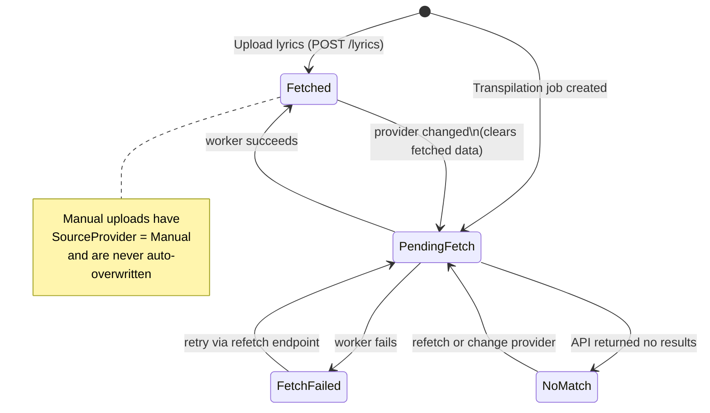

import { Aside, Steps, Tabs, TabItem, Badge } from '@astrojs/starlight/components';

Alexandria can fetch synced (LRC) and plain-text lyrics for your library automatically. When a track finishes processing, Alexandria looks up lyrics for it from an external provider and caches the result — no action needed on your part. If no match is found, or if you'd rather use your own, you can upload lyrics manually.

<Aside type="tip">
  **TL;DR**: Set `LYRICS_ENABLED=true` in your `.env` and lyrics will be fetched automatically for new tracks. Currently lyrics are sourced from [Lrclib](https://lrclib.net), a free public lyrics database. If you upload your own lyrics for a track, they're protected and will never be overwritten automatically.
</Aside>

---

## Configuration

### Environment Variables

| Variable | Required | Default | Description |
|---|---|---|---|
| `LYRICS_ENABLED` | Yes | — | Turns the entire lyrics system on or off |
| `MEDIA_METADATA_WORKER_RABBITMQ_PASSWORD` | Yes | — | RabbitMQ password for the metadata worker |
| `RABBITMQ_MEDIA_METADATA_WORKER` | Yes | `media_metadata_worker` | RabbitMQ username for the metadata worker |

### appsettings

In the API's `appsettings.json`, lyrics are also gated under `Features`:

```json
{
  "Features": {
    "Lyrics": true
  }
}
```

Both the API and the metadata worker read this setting — if either has lyrics disabled, that component won't register lyrics-related services or endpoints.

---

## Common Issues

- **No lyrics found for a track?** The lyrics provider doesn't have every song in its database, especially rare, regional, or unreleased tracks. If nothing turns up automatically, you can upload your own lyrics — once submitted, they're marked as manual and will never be overwritten by a future automated fetch.

*(This section will grow as more issues come up — suggestions welcome.)*

---

## How It Works

<Aside type="note">
  This section covers internal architecture and is mainly useful if you're developing or debugging Alexandria itself.
</Aside>

Lyrics are tied to a **transpilation job** — the processing step Alexandria runs on each track — rather than to the audio file directly. A track needs at least one completed transpilation job before lyrics can be fetched for it. In practice, this happens automatically as part of your normal library scan; you shouldn't need to trigger anything by hand.

Once a job exists, Alexandria queries an external provider through a small internal pipeline:

````mermaid
sequenceDiagram
    participant Browser
    participant API
    participant Queue as RabbitMQ (lyrics.#)
    participant Worker as LyricsWorker
    participant LrcLib as LrcLibPublicProvider

    Browser->>API: GET /lyrics/{jobId}
    alt No cached lyrics
        API->>Queue: Publish "lyrics.job"
        Queue->>Worker: Deliver job
        Worker->>LrcLib: 1. /get strict match
        LrcLib-->>Worker: no match
        Worker->>LrcLib: 2. /search fallback
        LrcLib-->>Worker: no match
        Worker->>LrcLib: 3. normalized variants
        LrcLib-->>Worker: result
        Worker->>API: DB write (Fetched) via LyricsRepository
    end
    API-->>Browser: { plainLyrics, syncedLyrics }
````

### Providers

Providers are pluggable — a `CompositeLyricsProvider` tries each registered provider in priority order, falling through to the next if one times out (40s) or returns nothing.

| Provider | Priority | Status |
|---|---|---|
| LrcLibPublic | 10 | Implemented |
| MusicXMatch | — | Planned, not yet implemented |

### LrcLib Lookup Strategy

The `LrcLibPublicProvider` queries the public [lrclib.net API](https://lrclib.net) with a multi-step fallback, normalizing the track title along the way (stripping things like `(feat. ...)`, `(Remastered)`, `(Deluxe Edition)`):

1. `/get` with all metadata — track, artist, album, duration
2. `/search` with original (unnormalized) track + artist
3. `/get` with normalized track + main artist (strips `feat.`, `&`, etc.)
4. `/search` with normalized track + main artist
5. `/get` with normalized track + main artist — final attempt

Each result carries a confidence score that drops with each fallback step, since later steps match on less information:

1. Exact match, all metadata — **10**
2. Search, original metadata — **8**
3. Normalized track + artist (`/get`) — **6**
4. Normalized search + artist — **5**
5. Final fallback (`/get`) — **2**

Instrumental tracks subtract 1 from whichever score they land on, and return both lyrics fields as `null` with `Instrumental: true`.

### Response Format

LrcLib can return two formats:
- **Plain lyrics** — raw text, no timestamps
- **Synced lyrics** — LRC format, with a `[mm:ss.xx]` timestamp on each line

### Lifecycle



- The worker sets `SourceProvider` to whichever provider succeeded (e.g. `LrclibPublic`)
- Manual uploads have `SourceProvider = Manual` and are never overwritten automatically
- Changing providers clears previously fetched data and resets `Status` to `PendingFetch`

### Worker

The lyrics pipeline runs inside the `Alexandria.Workers.MediaMetadata` container:

- Listens on the `lyrics.#` routing key (currently sharing `content-queue`; a dedicated queue is planned)
- Runs 2 concurrent consumers by default (`RabbitMQ:Consumer:Concurrency`)
- Re-queues messages on nack, so transient failures get retried
- Logs and discards `LyricsNotFoundException` (happens if a record is deleted between publish and consume)

It's named **MediaMetadata** rather than **LyricsWorker** because it's intended to handle other metadata enrichment beyond lyrics in the future.

---

## API Reference

All endpoints live under `Features/Streaming/Lyrics/` and require authentication.

### `GET /api/v1/lyrics/{jobId}`

Returns lyrics for a transpilation job. If nothing is cached yet, creates a `TrackLyrics` record (`Status = PendingFetch`), queues a fetch, and returns immediately — poll or wait for the result.

### `POST /api/v1/lyrics/{jobId}`

Upload your own lyrics for a job. Accepts `plainLyrics` and/or `syncedLyrics` (at least one required). Sets the provider to `Manual` and marks the record `Fetched` immediately — it will never be auto-overwritten.

### `DELETE /api/v1/lyrics/{lyricsId}`

Soft-deletes a lyrics record.

### `POST /api/v1/lyrics/{jobId}/refetch`

Resets the record to `PendingFetch` and re-queues a fetch. Not available for manual (user-submitted) lyrics — `DELETE` first if you want to replace them.

### `PATCH /api/v1/lyrics/{lyricsId}/provider`

Switches the provider for an existing record, clears previously fetched data, and re-queues a fetch. Not available for manual lyrics.
